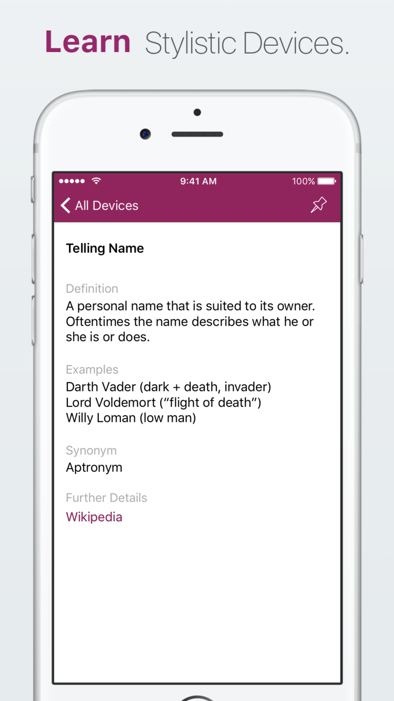
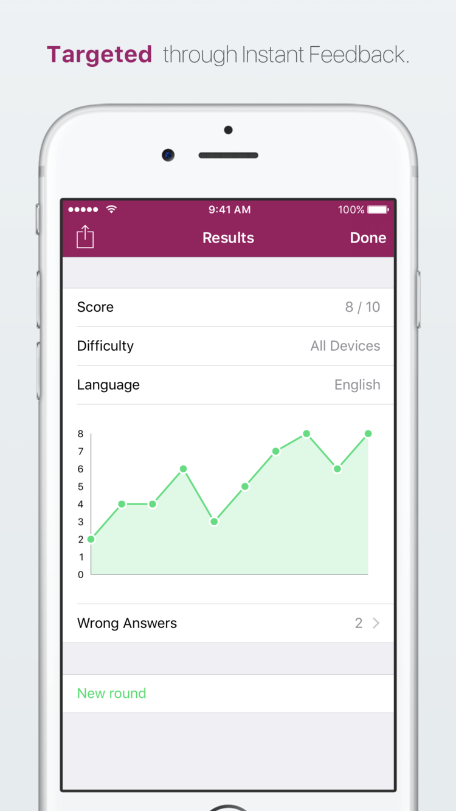
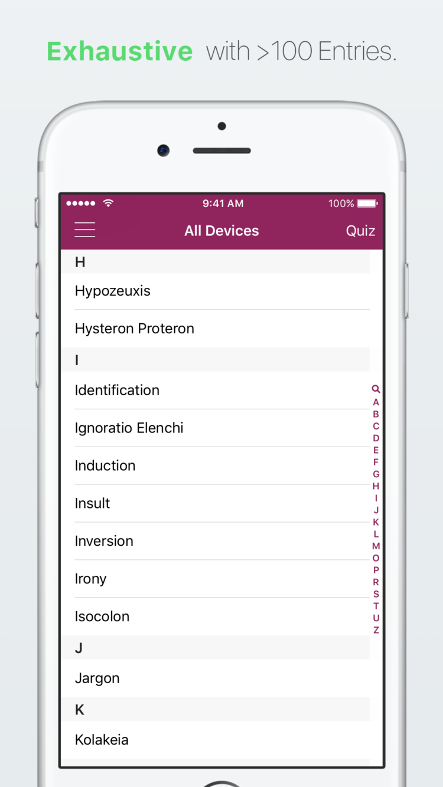
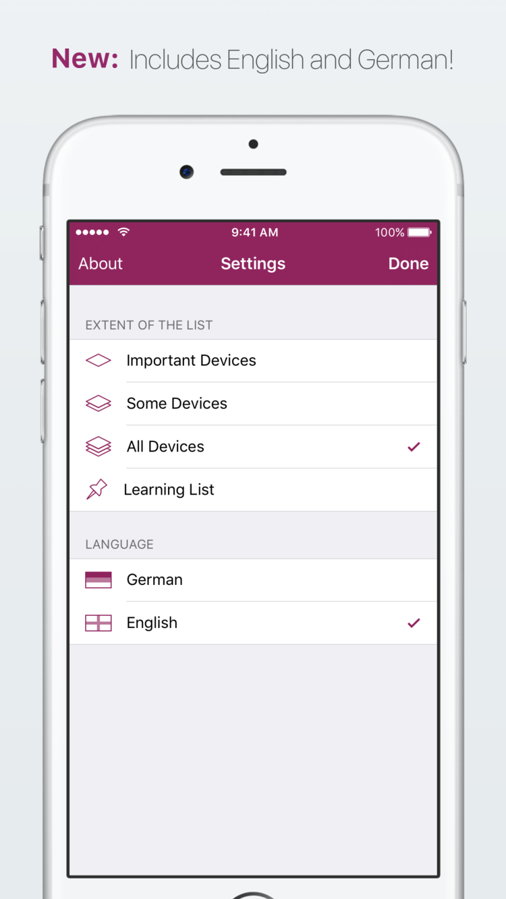

  
  
  
  
  

# Rhetorica

Rhetorica is an app for the iPhone and iPad that helps you learn stylistic devices.   
It provides an index of >100 devices both in German and English as well as a quiz mode for easy learning.

Latest release: v[1.3](https://github.com/nickpodratz/Rhetorica/releases/tag/v1.3)    
App Store page: 
[English](https://itunes.apple.com/app/rhetorica-stilmittel-einfach/id926449450?mt=8) |
[German](https://itunes.apple.com/de/app/binarify/id912928467?mt=8)

## What you need
- Computer running macOS
- XCode (available on the Mac App Store)
- Swift 2.3
- ruby
- bundler (ruby gem)

## How to get started
1. Open your terminal application and navigate to your directory of choice with `cd <path>`.
2. Execute `git clone https://github.com/nickpodratz/Rhetorica Rhetorica`.
3. Change directory into the repo with `cd Rhetorica`.
4. Install ruby dependencies by executing `bundle install`.
5. Install cocoa dependencies by executing `bundle exec pod install`.
5. Open the `Rhetorica.xcworkspace` file. (**not** `Rhetorica.xcodeproj`!)

## Deployment
Rhetorica is deployed via the [fastlane](https://github.com/fastlane/fastlane) tool.    
First navigate into the Rhetorica directory using `cd <path>`, then execute `fastlane appstore`.    
This command builds the app, signs it and uploads the binary to iTunes Connect for review.
